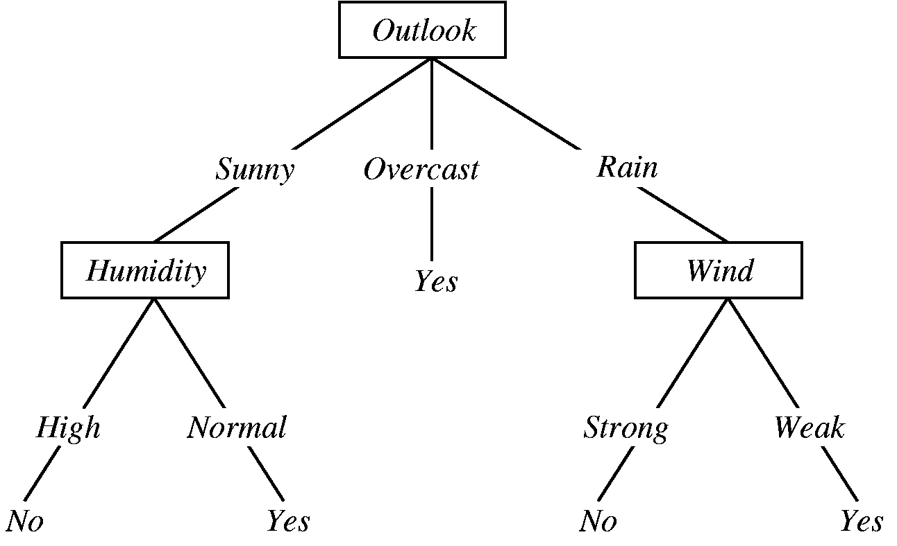

## Decision Tree in Machine Learning

A decision tree is a flowchart-like structure in which each internal node represents a `test` on a feature (e.g. whether a coin flip comes up heads or tails) , each leaf node represents a `class label` (decision taken after computing all features) and branches represent conjunctions of features that lead to those class labels. The paths from root to leaf represent `classification rules`. Below diagram illustrate the basic diagram of decision tree decision making with labels (Rain(Yes), No Rain(No)).

Decision tree is one of the predictive modelling approaches used in `statistics`, `data mining` and `machine learning`. Tree models where the target variable can take a discrete set of values are called **classification trees**. Decision trees where the target variable can take continuous values (typically real numbers) are called **regression trees**. Classification And Regression Tree (CART) is general term for this.

Throughout this post i will try to explain using the examples.

#### Data Format

Data comes in records of forms.

    (x,Y)=(x1,x2,x3,....,xk,Y)

The dependent variable, Y, is the target variable that we are trying to understand, classify or generalize. The vector x is composed of the features, x1, x2, x3 etc., that are used for that task.

**Example**
      
      training_data = [
                      ['Green', 3, 'Apple'],
                      ['Yellow', 3, 'Apple'],
                      ['Red', 1, 'Grape'],
                      ['Red', 1, 'Grape'],
                      ['Yellow', 3, 'Lemon'],
                      ]
     # Header = ["Color", "diameter", "Label"]
     # The last column is the label.
     # The first two columns are features.

While making decision tree, at each node of tree we ask different type of questions. Based on the asked question we will calculate the information gain corresponding to it.

Information gain is used to decide which feature to split on at each step in building the tree. Simplicity is best, so we want to keep our tree small. To do so, at each step we should choose the split that results in the purest daughter nodes. A commonly used measure of purity is called information. For each node of the tree, the information value **represents the expected amount of information that would be needed to specify whether a new instance should be classified yes or no, given that the example reached that node**

### Asking Question
 
    class Question:
      """A Question is used to partition a dataset.

      This class just records a 'column number' (e.g., 0 for Color) and a
      'column value' (e.g., Green). The 'match' method is used to compare
      the feature value in an example to the feature value stored in the
      question. See the demo below.
      """

      def __init__(self, column, value):
          self.column = column
          self.value = value

      def match(self, example):
          # Compare the feature value in an example to the
          # feature value in this question.
          val = example[self.column]
          if is_numeric(val):
              return val >= self.value
          else:
              return val == self.value

      def __repr__(self):
          # This is just a helper method to print
          # the question in a readable format.
          condition = "=="
          if is_numeric(self.value):
              condition = ">="
          return "Is %s %s %s?" % (
              header[self.column], condition, str(self.value))
            

Lets try querying questions and its outputs.

    Question(1, 3) ## Is diameter >= 3?
    Question(0, "Green") ## Is color == Green?
    
